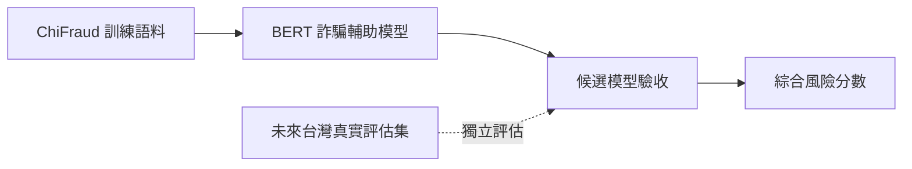

# ScamLens-TW

> **文件版本**：v1.0
> **最後修改**：2026-07-23
> **作者**：ScamLens-TW 專案團隊
> **摘要**：定義 ChiFraud BERT 重訓、驗收與風險融合使用的共同術語。

ScamLens-TW 將圖片、語音與直接輸入內容統一視為文字內容，提供可解釋的詐騙風險判斷。

## Language

**ChiFraud 訓練語料**:
公開且已標註的中文網頁詐騙資料，是現階段詐騙模型的主要訓練來源；其用語不等同台灣真實語境。
_Avoid_: 台灣語料、台灣 gold set

**台灣模擬診斷集**:
依公開反詐模式建立並經專案負責人採納的 200 筆模擬案例，只用於發現流程與語境缺口，不代表真實世界效果。
_Avoid_: 訓練集、真實案例、gold set

**台灣真實評估集**:
來自台灣真實語境、具合法來源並完成可靠人工標註的獨立評估資料；目前尚未具備。
_Avoid_: 模擬案例、預標註資料

**BERT 詐騙輔助模型**:
只判斷文字較接近正常或詐騙內容，標籤固定為 0＝正常、1＝詐騙；它不是產品最終輸出。
_Avoid_: 詐騙類型模型、產品風險結果

**乾淨分類微調**:
從原始 `bert-base-chinese` 預訓練權重開始，重新使用 ChiFraud 訓練詐騙／正常分類器，不沿用現有 `bert_fraud` checkpoint。
_Avoid_: 隨機權重從頭訓練、沿用舊模型繼續訓練

**模型標籤契約**:
BERT checkpoint 必須明確保存 0＝NORMAL、1＝FRAUD；推論依模型設定尋找 FRAUD 標籤，不得固定讀取某一輸出欄，缺失或衝突時拒絕載入。
_Avoid_: 預設第 0 欄為詐騙、推論時猜測標籤方向

**候選模型**:
完成訓練但尚未部署的單一 BERT checkpoint，連同資料版本、切分種子、訓練參數、標籤映射、校準門檻及分年度指標接受驗收。
_Avoid_: 正式模型、已部署模型

**候選模型驗收**:
2022 與 2023 test 的詐騙 Recall 都至少 90%；中風險正常誤報率都不超過 12%，高風險都不超過 5%；合併 test 中樣本至少 50 筆的每個詐騙子類 Recall 至少 70%，並通過標籤、滑動窗口與 localhost smoke test。
_Avoid_: 只看 Accuracy、只看合併年度、使用 test 調整門檻

**領域後訓練**:
乾淨分類微調未達驗收標準時，才使用 ChiFraud 文字做遮罩語言模型訓練，再重新進行分類微調的候選改善方法。
_Avoid_: 第一階段必要流程、隨機權重預訓練

**綜合風險分數**:
規則證據分數與校準後 BERT 模型分數取較高者；兩者同時達中風險時加 10 分，結果限制於 0 至 100。它是排序與分級指標，不代表真實詐騙機率。
_Avoid_: BERT 機率、詐騙發生率

**一致性加分**:
規則證據與 BERT 模型分數都達到中風險時加入綜合風險分數的 10 分，表示兩條獨立判斷通道方向一致。
_Avoid_: 重複命中加分、模型信心值

**詐騙子類平衡**:
避免高頻 ChiFraud 詐騙類型主導模型、同時不把稀少類型偽裝成自然等量的取樣原則。
_Avoid_: 完全等量取樣、只做二元類別平衡

**詐騙漏報**:
實際為詐騙卻被模型判為正常；在 ScamLens-TW 的模型選擇中，其代價高於正常誤報。
_Avoid_: False Positive、誤報

**正常誤報**:
正常內容被模型判為詐騙；它是必須限制的護欄，但優先級低於降低詐騙漏報。
_Avoid_: False Negative、漏報
