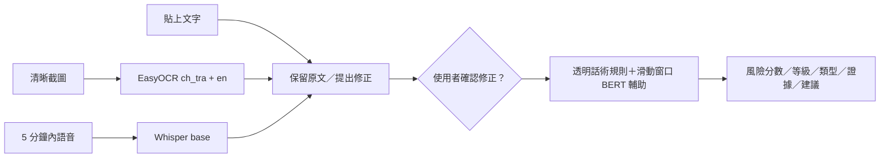

# ScamLens-TW

> **文件版本**：v4.1.0
> **最後修改**：2026-07-23
> **作者**：ScamLens-TW 專案團隊
> **摘要**：localhost 圖片／文字／語音內容防詐，以及 ChiFraud BERT 可重現重訓與安全升級說明。

以文字內容為核心的 localhost 防詐分析工具。一次可貼上文字、上傳一張清晰截圖，或上傳最長五分鐘的語音；圖片與語音只負責取得文字，三種入口最後使用同一套內容風險分析。

輸出包含 0–100 風險分數、低／中／高風險、現有七類詐騙類型、命中話術與固定安全建議。風險分數尚未經台灣真實 gold set 校準，不是詐騙機率，也不是事實或法律認定。

## 功能

- 純文字：LINE、簡訊、社群貼文或 Gmail 內文。
- 截圖：EasyOCR 本機辨識繁體中文與英文，單張最多 10 MB。
- 語音：現有 Whisper `base` 本機轉錄，最長 5 分鐘。
- 修正：純文字貼上直接分析原文；只有 OCR／語音轉錄文字才由小型 MacBERT 提出錯字、標點與斷句候選，且需使用者確認才生效。
- 長文字：BERT 使用 256-token 視窗與 64-token 重疊，保留最高風險窗口。
- 隱私：不保存輸入、分析歷史或原始內容 log，暫存語音在成功與失敗後都清除。
- 降級：BERT 或修正模型不可用時，透明規則仍可分析；模型不會在分析請求中偷偷下載。

## 架構



聲紋、合成語音辨識、FAISS 記憶、RAG、自動案例寫入、歷史 API 與 SE-Attention 已從產品流程移除。

## 安裝

建議使用 Python 3.11 與 `uv`：

```powershell
uv venv --python 3.11
uv pip install -r requirements.txt
```

模型權重不進 Git。首次設定時明確下載到本機：

```powershell
.venv\Scripts\python.exe scripts\prepare_models.py all
.venv\Scripts\python.exe scripts\preflight.py
```

`prepare_models.py` 是唯一會下載新模型的步驟。一般啟動與分析只讀取 `models/` 中的本機權重。

## ChiFraud BERT 重訓

正式流程會從固定版本的 [`google-bert/bert-base-chinese`](https://huggingface.co/google-bert/bert-base-chinese) 做乾淨二元分類 fine-tuning，不沿用現有分類頭。資料先稽核 [ChiFraud 官方 repository](https://github.com/xuemingxxx/ChiFraud) 的 `class.txt` 與 11 類分布，並與 [COLING 2025 論文](https://aclanthology.org/2025.coling-main.398/) 交叉確認後，再產生簡體原文及繁體轉譯的成對 split。來源於 2026-07-23 查核；同一正規化文字不可跨 split。2022、2023 都會進入 train／validation／test，test 不參與 checkpoint、溫度、門檻或超參數選擇。

Kaggle 的主要入口是 `notebooks/02_chifraud_dual_script_experiment.ipynb`；`01_bert_fraud_training.ipynb` 僅保留為舊版實驗紀錄，不應作為候選產物來源。CLI 等價流程：

```powershell
.venv\Scripts\python.exe -m src.chifraud_data <ChiFraud\dataset> artifacts\chifraud_prepared --source-revision <commit-sha> --seed 42
.venv\Scripts\python.exe -m scripts.run_chifraud_experiment artifacts\chifraud_prepared artifacts\chifraud_experiment --base-model google-bert/bert-base-chinese --base-revision <commit-sha> --seeds 42
```

實驗會各自訓練簡體與繁體候選，並讓兩個模型都在簡體／繁體 test view、2022／2023 年度上交叉驗收。主要硬門檻為每年詐騙 Recall 至少 90%；正常樣本中風險誤報率不得高於 12%、高風險誤報率不得高於 5%。若單一 seed 無法判定，使用全新 output 以 `--seeds 42 43 44` 重跑。

先驗證下載回來的候選目錄：

```powershell
.venv\Scripts\python.exe -m scripts.promote_bert_candidate <candidate-dir>
```

確認 `selection_report.json` 已選出該候選且驗證成功後，才執行 localhost 切換：

```powershell
.venv\Scripts\python.exe -m scripts.promote_bert_candidate <candidate-dir> --selection-report <experiment-dir>\selection_report.json --target models\bert_fraud --promote
```

既有模型會保留為 `models\bert_fraud.previous`；若該目錄已存在，腳本會拒絕覆寫，要求先人工確認。候選輸出、模型權重與原始資料皆不提交 Git。

## 啟動

```powershell
.venv\Scripts\python.exe -m src.main
```

開啟 `http://127.0.0.1:7861/`。

## API

`POST /api/analyze` 使用 multipart form，一次只能提供：

- `text`：最多 20,000 字；或
- `upload`：一張 `.png/.jpg/.jpeg/.webp`；或
- `upload`：一段 `.wav/.mp3/.m4a/.flac/.ogg`。

若回傳 `needs_confirmation`，前端顯示原文與建議修正版。使用者選擇後，以 `correction_confirmed=true` 和選定文字再次呼叫同一端點。

## 驗證

```powershell
.venv\Scripts\python.exe -m pytest -q
node --check static\app.js
.venv\Scripts\python.exe -m compileall -q src config scripts
```

測試以統一 HTTP API 為主要 seam，模型推論以本機 smoke check 補充。自製或模擬案例只能驗證流程，不得宣稱為真實台灣 gold data。

## 範圍限制

- 不整合 Gmail／Outlook；Email 內容可貼到文字入口。
- 不支援混合多種輸入、批次分析或多張圖片。
- 不承諾辨識模糊、反光、傾斜、手寫或複雜實體文件。
- 不使用 Redis、帳號、雲端 OCR 或雲端 LLM。
- 不宣稱正式產品準確率或台灣真實語境成效。
