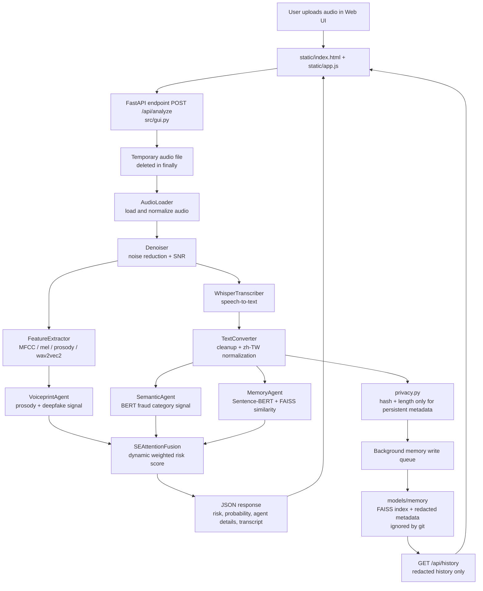

# AI_Voice

智慧語音詐騙檢測系統。系統接收通話音訊後，透過音訊預處理、Whisper 語音轉錄、聲紋/語義/記憶三 Agent 分析，以及 SE-Attention 融合，輸出詐騙風險評分與分析結果。

## Features

- FastAPI Web UI 與 REST API
- 音訊預處理、降噪與聲學特徵萃取
- Whisper 中文語音轉錄
- 聲紋異常、語義詐騙模式、歷史記憶比對三路分析
- SE-Attention 融合風險分數
- 隱私保護：長期歷史 API 不回傳原始轉錄文字，log 不保存轉錄片段

## Project Structure

```text
.env.example                    Local environment template, no real secrets
.gitignore                      Ignore rules for secrets, logs, datasets, audio, and model artifacts
README.md                       Project overview and runtime guide
requirements.txt                Python dependency list

config/
  settings.py                   Central runtime paths and model configuration

src/
  gui.py                        FastAPI web server, REST endpoints, static UI mounting
  main.py                       CLI-style orchestrator for end-to-end detection
  models.py                     Shared dataclasses for audio features, transcripts, agent results, fusion results
  privacy.py                    Transcript redaction, metadata minimization, safe upload suffix helpers

  step1_preprocessing/
    audio_loader.py             Audio loading and sample-rate normalization
    denoiser.py                 Noise reduction and SNR estimation
    feature_extractor.py        MFCC, mel, prosody, and wav2vec2 feature extraction

  step2_transcription/
    whisper_transcriber.py      Whisper-based speech-to-text transcription
    text_converter.py           Text cleanup and Simplified-to-Traditional Chinese conversion

  step3_agents/
    base_agent.py               Common agent result helpers
    voiceprint_agent.py         Acoustic and deepfake voiceprint risk analysis
    semantic_agent.py           BERT-based fraud semantics analysis
    memory_agent.py             FAISS/Sentence-BERT memory matching with redacted metadata

  step4_fusion/
    se_attention_fusion.py      SE-Attention fusion of agent scores into final risk

  step5_report/
    report_generator.py         Report generation support

  utils/
    exceptions.py               Shared exception types
    logger.py                   Shared logger setup

static/
  index.html                    Web UI shell
  app.js                        Browser-side upload, progress, result, and history interactions
  style.css                     Web UI styling

notebooks/
  01_bert_fraud_training.ipynb  Semantic model training workflow
  02_voiceprint_training.ipynb  Voiceprint model training workflow
  03_memory_and_fusion_training.ipynb
                                Memory index and fusion model training workflow

Local-only, ignored by git:
  models/                       Model artifacts and FAISS indexes
  data/                         Local datasets
  logs/                         Runtime logs
  metadata.json                 Raw local training metadata
  uploaded audio files          WAV/MP3/M4A/FLAC/OGG
```

## Architecture Flow



## Architecture Details

### Web And API Layer

`static/index.html`, `static/app.js`, and `static/style.css` provide the browser UI. The UI lets a user upload an audio file, shows step-by-step progress, renders the risk score, displays agent-level details, and loads the long-term history view.

`src/gui.py` is the FastAPI application. It mounts the static UI, exposes `POST /api/analyze` for audio analysis, exposes `GET /api/history` for redacted long-term history, and exposes `DELETE /api/history/{case_id}` for removing a memory item. It also owns the background queue that writes analyzed cases into the memory store.

### Step 1: Audio Preprocessing

`src/step1_preprocessing/audio_loader.py` loads the uploaded audio and normalizes it to the configured target sample rate. This gives the downstream models a consistent waveform format.

`src/step1_preprocessing/denoiser.py` reduces background noise and estimates SNR. SNR is returned to the UI as a quality indicator and is also attached to the extracted feature object.

`src/step1_preprocessing/feature_extractor.py` extracts acoustic features such as MFCCs, mel features, prosody, and optional wav2vec2 embeddings. These features feed the voiceprint analysis path.

### Step 2: Transcription

`src/step2_transcription/whisper_transcriber.py` runs Whisper transcription and returns a structured transcript object with text, timing segments, language, and confidence information.

`src/step2_transcription/text_converter.py` cleans transcript text and normalizes Chinese text for downstream semantic analysis. This keeps the BERT and memory matching paths working with a more consistent text format.

### Step 3: Multi-Agent Analysis

`src/step3_agents/voiceprint_agent.py` analyzes acoustic features for signs of synthetic or abnormal voice patterns. It combines prosody and deepfake-model signals into a voiceprint fraud probability.

`src/step3_agents/semantic_agent.py` analyzes the transcript text with the local fraud BERT model. It estimates fraud probability from language patterns and fraud category cues.

`src/step3_agents/memory_agent.py` compares the current transcript embedding against historical cases using Sentence-BERT and FAISS. It returns similarity-based fraud evidence without exposing raw historical transcript text through the history API.

### Step 4: Fusion

`src/step4_fusion/se_attention_fusion.py` combines the three agent outputs. The SE-Attention fusion layer dynamically weights each agent's probability, confidence, and signal quality, then returns the final fraud probability and risk level.

### Privacy Boundary

`src/privacy.py` contains the privacy controls. The current analysis response can return the transcript to the active caller, but persistent memory metadata stores only derived information such as text length and SHA-256 fingerprint. The history API returns redacted placeholders rather than raw transcript content.

Runtime artifacts such as `models/`, `data/`, `logs/`, raw `metadata.json`, audio uploads, FAISS indexes, and model archives are local-only and ignored by git.

## Setup

Use `uv` for Python environment management.

```powershell
uv python install 3.11.15
$env:VIRTUAL_ENV=(Resolve-Path .venv).Path
$env:PATH="$env:VIRTUAL_ENV\Scripts;$env:PATH"
uv run --active python -m uvicorn src.gui:app --host 127.0.0.1 --port 7861 --loop asyncio --http h11 --access-log
```

Open:

```text
http://127.0.0.1:7861/
```

## Privacy And Repository Hygiene

Do not commit runtime data, model artifacts, uploaded audio, API keys, tokens, credentials, logs, or raw transcript metadata. The `.gitignore` excludes common sensitive files including:

- `.env`, `.env.*`, `.envrc`
- `*token*`, `*secret*`, `*credential*`, `*api_key*`, `*api-key*`, `*apikey*`
- `client_secret*.json`, `service-account*.json`, `service_account*.json`, `kaggle.json`
- `*.pem`, `*.key`, `*.p12`, `*.pfx`
- `metadata.json`, `data/`, `models/`, `logs/`, audio files, FAISS indexes, model archives

Before publishing, run a secret scan and verify that no raw user transcript or sensitive dataset has been staged.
