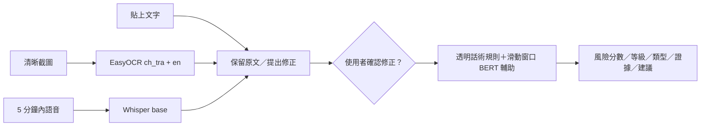

# ScamLens-TW

以文字內容為核心的 localhost 防詐分析工具。一次可貼上文字、上傳一張清晰截圖，或上傳最長五分鐘的語音；圖片與語音只負責取得文字，三種入口最後使用同一套內容風險分析。

輸出包含 0–100 風險分數、低／中／高風險、現有七類詐騙類型、命中話術與固定安全建議。風險分數尚未經台灣真實 gold set 校準，不是詐騙機率，也不是事實或法律認定。

## 功能

- 純文字：LINE、簡訊、社群貼文或 Gmail 內文。
- 截圖：EasyOCR 本機辨識繁體中文與英文，單張最多 10 MB。
- 語音：現有 Whisper `base` 本機轉錄，最長 5 分鐘。
- 修正：小型 MacBERT 只提出錯字、標點與斷句候選；使用者確認後才生效。
- 長文字：BERT 使用 256-token 視窗與 64-token 重疊，保留最高風險窗口。
- 隱私：不保存輸入、分析歷史或原始內容 log，暫存語音在成功與失敗後都清除。
- 降級：BERT 或修正模型不可用時，透明規則仍可分析；模型不會在分析請求中偷偷下載。

## 架構



聲紋、合成語音辨識、FAISS 記憶、RAG、自動案例寫入、歷史 API 與 SE-Attention 已從產品流程移除。

## 安裝

建議使用 Python 3.11 與 `uv`：

```powershell
uv venv --python 3.11
uv pip install -r requirements.txt
```

模型權重不進 Git。首次設定時明確下載到本機：

```powershell
.venv\Scripts\python.exe scripts\prepare_models.py all
.venv\Scripts\python.exe scripts\preflight.py
```

`prepare_models.py` 是唯一會下載新模型的步驟。一般啟動與分析只讀取 `models/` 中的本機權重。

## 啟動

```powershell
.venv\Scripts\python.exe -m src.main
```

開啟 `http://127.0.0.1:7861/`。

## API

`POST /api/analyze` 使用 multipart form，一次只能提供：

- `text`：最多 20,000 字；或
- `upload`：一張 `.png/.jpg/.jpeg/.webp`；或
- `upload`：一段 `.wav/.mp3/.m4a/.flac/.ogg`。

若回傳 `needs_confirmation`，前端顯示原文與建議修正版。使用者選擇後，以 `correction_confirmed=true` 和選定文字再次呼叫同一端點。

## 驗證

```powershell
.venv\Scripts\python.exe -m pytest -q
node --check static\app.js
.venv\Scripts\python.exe -m compileall -q src config scripts
```

測試以統一 HTTP API 為主要 seam，模型推論以本機 smoke check 補充。自製或模擬案例只能驗證流程，不得宣稱為真實台灣 gold data。

## 範圍限制

- 不整合 Gmail／Outlook；Email 內容可貼到文字入口。
- 不支援混合多種輸入、批次分析或多張圖片。
- 不承諾辨識模糊、反光、傾斜、手寫或複雜實體文件。
- 不使用 Redis、帳號、雲端 OCR 或雲端 LLM。
- 不宣稱正式產品準確率或台灣真實語境成效。
