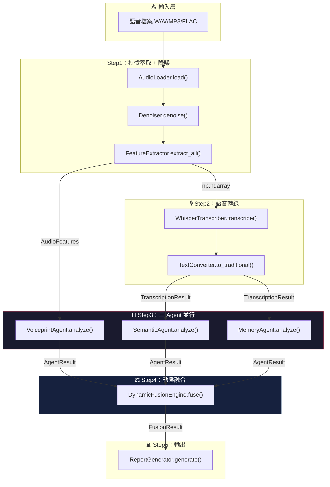
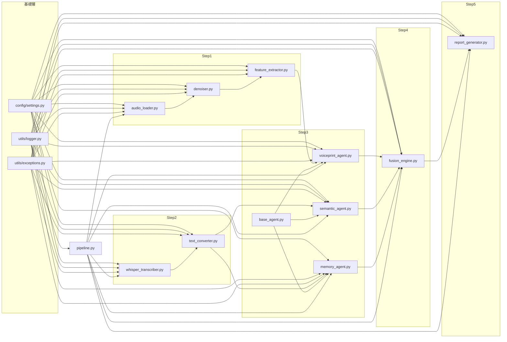
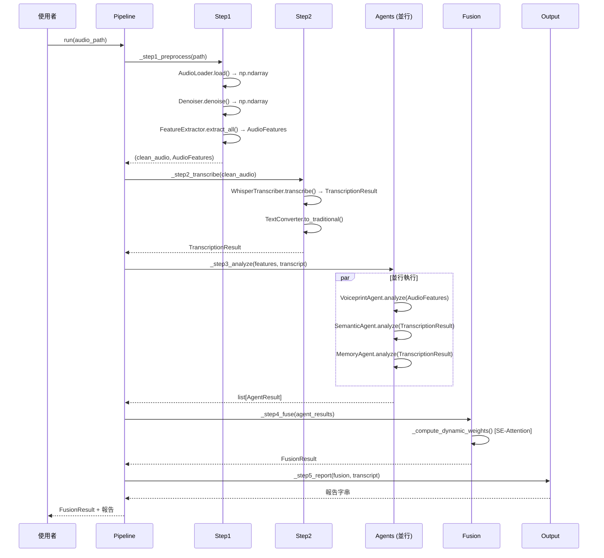
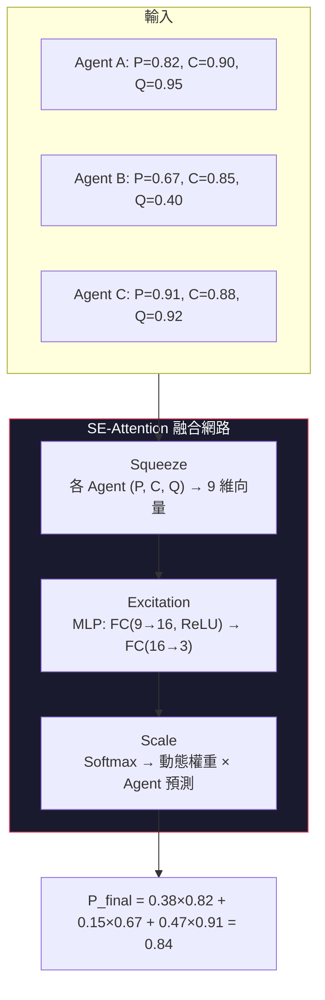

# AI_Voice 系統架構文件

> **版本**: v1.0.0  
> **日期**: 2026-03-26  
> **專案**: 智慧語音詐騙檢測工具

---

## 系統架構總覽



---

## 模組依賴關係



---

## 資料流序列圖



---

## 資料結構定義

### Step1 輸出

```python
@dataclass
class ProsodyFeatures:
    """韻律特徵"""
    jitter: float              # 基頻微抖動（%）
    shimmer: float             # 振幅微抖動（%）
    hnr: float                 # 諧波噪聲比（dB）
    f0_mean: float             # 基頻均值（Hz）
    f0_std: float              # 基頻標準差（Hz）
    f0_range: float            # 基頻範圍（Hz）
    speaking_rate: float       # 語速（音節/秒）
    pause_durations: list[float]  # 停頓時長清單（秒）
    formants: list[float]      # 共振峰 [F1, F2, F3, F4]（Hz）

@dataclass
class AudioFeatures:
    """音頻特徵集合"""
    mfcc: np.ndarray              # (40, T)
    mel_spectrogram: np.ndarray   # (128, T)
    zcr: np.ndarray               # (1, T)
    spectral_centroid: np.ndarray # (1, T)
    prosody: ProsodyFeatures
    wav2vec2_features: torch.Tensor | None  # 深度特徵
```

### Step2 輸出

```python
@dataclass
class TranscriptionSegment:
    """轉錄片段"""
    start: float    # 開始時間（秒）
    end: float      # 結束時間（秒）
    text: str       # 片段文字

@dataclass
class TranscriptionResult:
    """轉錄結果"""
    text: str                             # 完整文字稿（繁體中文）
    segments: list[TranscriptionSegment]  # 帶時間戳片段
    language: str                         # 偵測語言代碼
    confidence: float                     # 轉錄信心度 [0, 1]
```

### Step3 輸出

```python
@dataclass
class AgentResult:
    """Agent 分析結果"""
    agent_name: str            # Agent 名稱
    fraud_probability: float   # 詐騙機率 [0, 1]
    confidence: float          # 模型信心度 [0, 1]
    signal_quality: float      # 信號品質 [0, 1]
    details: dict              # 詳細分析資訊
    explanation: str           # 人類可讀說明
```

### Step4 輸出

```python
@dataclass
class FusionResult:
    """融合判決結果"""
    final_probability: float          # 最終詐騙機率 [0, 1]
    risk_level: str                   # "高風險" / "中風險" / "低風險"
    dynamic_weights: dict[str, float] # {"voiceprint": 0.38, "semantic": 0.15, "memory": 0.47}
    agent_results: list[AgentResult]  # 原始 Agent 結果
```

---

## 函數調用接口

### `src/step1_preprocessing/audio_loader.py`

```python
class AudioLoader:
    """音頻載入與前處理器"""

    def __init__(self, target_sr: int = 16000) -> None:
        """初始化
        Args:
            target_sr: 目標取樣率，預設 16kHz
        """

    def load(self, file_path: str) -> tuple[np.ndarray, int]:
        """載入音頻檔案並重取樣
        Args:
            file_path: 音頻檔案路徑（支援 WAV/MP3/FLAC/OGG）
        Returns:
            (audio_array, sample_rate) 單聲道 float32 陣列
        Raises:
            AudioLoadError: 檔案格式不支援或損壞
        """

    def segment(self, audio: np.ndarray, sr: int,
                max_duration: float = 30.0) -> list[np.ndarray]:
        """將超長音頻切割為可處理片段
        Args:
            audio: 音頻陣列
            sr: 取樣率
            max_duration: 最大片段秒數
        Returns:
            音頻片段清單
        """

    def remove_silence(self, audio: np.ndarray, sr: int,
                       top_db: int = 30) -> np.ndarray:
        """偵測並去除靜音片段
        Args:
            audio: 音頻陣列
            sr: 取樣率
            top_db: 靜音偵測閾值（dB）
        Returns:
            去除靜音後的音頻陣列
        """
```

### `src/step1_preprocessing/denoiser.py`

```python
class Denoiser:
    """語音降噪處理器"""

    def __init__(self, prop_decrease: float = 0.8) -> None:
        """初始化
        Args:
            prop_decrease: 降噪強度 (0~1)，1 為完全降噪
        """

    def denoise(self, audio: np.ndarray, sr: int) -> np.ndarray:
        """Spectral Gating 自適應降噪
        Args:
            audio: 原始音頻陣列
            sr: 取樣率
        Returns:
            降噪後的音頻陣列
        Raises:
            AudioDenoiseError: 降噪失敗
        """

    def estimate_noise_profile(self, audio: np.ndarray,
                               sr: int) -> np.ndarray:
        """自動估算噪音 profile
        Args:
            audio: 音頻陣列
            sr: 取樣率
        Returns:
            噪音頻譜估計
        """
```

### `src/step1_preprocessing/feature_extractor.py`

```python
class FeatureExtractor:
    """特徵萃取器（通用 + 韻律 + 深度）"""

    def __init__(self, n_mfcc: int = 40, n_mels: int = 128,
                 use_wav2vec2: bool = True) -> None:
        """初始化
        Args:
            n_mfcc: MFCC 係數數量
            n_mels: Mel 頻帶數量
            use_wav2vec2: 是否提取 Wav2vec2 深度特徵
        """

    def extract_all(self, audio: np.ndarray, sr: int) -> AudioFeatures:
        """萃取所有特徵
        Args:
            audio: 降噪後音頻陣列
            sr: 取樣率
        Returns:
            AudioFeatures 完整特徵集合
        Raises:
            FeatureExtractionError: 萃取失敗
        """

    def extract_prosody(self, audio: np.ndarray,
                        sr: int) -> ProsodyFeatures:
        """使用 parselmouth 萃取韻律特徵
        Returns:
            ProsodyFeatures (Jitter/Shimmer/HNR/F0/Formant/Pause)
        """

    def extract_wav2vec2(self, audio: np.ndarray,
                         sr: int) -> torch.Tensor:
        """使用 Wav2vec2-base 萃取深度特徵
        Returns:
            隱藏層表示 Tensor
        """
```

### `src/step2_transcription/whisper_transcriber.py`

```python
class WhisperTranscriber:
    """Whisper 離線轉錄器"""

    def __init__(self, model_size: str = "medium",
                 device: str = "cuda") -> None:
        """初始化
        Args:
            model_size: Whisper 模型大小
            device: 推理裝置 ("cuda" / "cpu")
        """

    def transcribe(self, audio: np.ndarray, sr: int,
                   language: str = "zh") -> TranscriptionResult:
        """轉錄音頻為文字
        Args:
            audio: 降噪後音頻陣列
            sr: 取樣率
            language: 指定語言（"zh" 跳過偵測）
        Returns:
            TranscriptionResult（文字稿 + 時間戳 + 信心度）
        Raises:
            WhisperModelError: 模型載入或推理失敗
        """
```

### `src/step2_transcription/text_converter.py`

```python
class TextConverter:
    """繁簡轉換與文字處理"""

    def __init__(self, mode: str = "s2twp") -> None:
        """初始化
        Args:
            mode: OpenCC 轉換模式（s2twp = 簡→繁+台灣用語）
        """

    def to_traditional(self, text: str) -> str:
        """簡體中文 → 繁體中文（台灣用語偏好）
        Args:
            text: 簡體中文文字
        Returns:
            繁體中文文字
        """

    def detect_language(self, text: str) -> str:
        """偵測文字語言
        Returns:
            語言代碼 ("zh" / "en" / "unknown")
        """
```

### `src/step3_agents/base_agent.py`

```python
class BaseAgent(ABC):
    """Agent 抽象基底類別"""

    def __init__(self, name: str, model_path: str | None = None) -> None:
        """初始化
        Args:
            name: Agent 名稱
            model_path: 模型權重檔案路徑
        """

    @abstractmethod
    def load_model(self) -> None:
        """載入模型權重（子類別必須實作）
        Raises:
            ModelLoadError: 權重檔案不存在或損壞
        """

    @abstractmethod
    def analyze(self, **kwargs) -> AgentResult:
        """執行分析（子類別必須實作）
        Returns:
            AgentResult
        Raises:
            AgentAnalysisError: 分析失敗
        """
```

### `src/step3_agents/voiceprint_agent.py`

```python
class VoiceprintAgent(BaseAgent):
    """Agent A：聲紋分析（韻律 + 深偽雙層模型）"""

    def __init__(self, prosody_model_path: str,
                 deepfake_model_path: str) -> None:
        """初始化
        Args:
            prosody_model_path: LightGBM 韻律模型路徑 (.pkl)
            deepfake_model_path: Wav2vec2+CNN 深偽模型路徑 (.pt)
        """

    def analyze(self, audio_features: AudioFeatures) -> AgentResult:
        """綜合聲紋分析
        Args:
            audio_features: Step1 萃取的完整音頻特徵
        Returns:
            AgentResult（韻律+深偽融合分數）
        """

    def _analyze_prosody(self, prosody: ProsodyFeatures) -> float:
        """韻律分析子模組 → [0, 1] 異常分數"""

    def _analyze_deepfake(self, wav2vec2_feat: torch.Tensor) -> float:
        """深偽偵測子模組 → [0, 1] 合成語音分數"""

    def _compute_signal_quality(self,
                                audio_features: AudioFeatures) -> float:
        """計算信號品質（基於 SNR / 長度 / 頻譜完整度）→ [0, 1]"""
```

### `src/step3_agents/semantic_agent.py`

```python
class SemanticAgent(BaseAgent):
    """Agent B：語義詐騙分析"""

    def __init__(self, model_path: str) -> None:
        """初始化
        Args:
            model_path: BERT fine-tuned 模型路徑 (.pt)
        """

    def analyze(self, transcript: TranscriptionResult) -> AgentResult:
        """分析轉錄文字的詐騙語義
        Args:
            transcript: Step2 的轉錄結果
        Returns:
            AgentResult（詐騙分類 + 關鍵詞）
        """

    def classify_fraud_type(self, text: str) -> tuple[str, float]:
        """詐騙類型分類 → (類別名, 機率)"""

    def extract_fraud_keywords(self, text: str) -> list[str]:
        """提取詐騙關鍵詞"""

    def _compute_signal_quality(self,
                                transcript: TranscriptionResult) -> float:
        """基於文字稿長度/轉錄信心/覆蓋率計算品質 → [0, 1]"""
```

### `src/step3_agents/memory_agent.py`

```python
class WorkingMemory:
    """短期記憶（會話層級）"""
    def store(self, key: str, value: Any) -> None: ...
    def retrieve(self, key: str) -> Any: ...
    def get_recent_judgments(self, n: int = 10) -> list[dict]: ...

class PersistentMemory:
    """長期記憶（FAISS 向量索引）"""

    def __init__(self, index_path: str, meta_path: str) -> None:
        """初始化
        Args:
            index_path: FAISS 索引檔案路徑
            meta_path: 案例元資料 JSON 路徑
        """

    def search(self, query_embedding: np.ndarray,
               top_k: int = 5) -> list[MemoryMatch]:
        """搜尋最相似的歷史案例
        Args:
            query_embedding: 查詢向量（384 維）
            top_k: 返回前 K 個結果
        Returns:
            MemoryMatch 清單（含相似度/文字/類型/時間戳）
        """

    def insert(self, embedding: np.ndarray, metadata: dict) -> None:
        """插入新案例至索引"""

@dataclass
class MemoryMatch:
    """記憶匹配結果"""
    similarity: float   # 餘弦相似度 [0, 1]
    case_text: str       # 匹配案例文字
    fraud_type: str      # 詐騙類型
    timestamp: str       # 案例時間戳

class MemoryOptimizer:
    """記憶優化器"""

    def deduplicate(self, threshold: float = 0.95) -> int:
        """去除相似度 > threshold 的重複案例 → 返回刪除數量"""

    def apply_time_decay(self, decay_rate: float = 0.01) -> None:
        """對歷史案例套用時間衰減加權"""

class MemoryAgent(BaseAgent):
    """Agent C：EvoAgentX 風格記憶系統"""

    def __init__(self, index_path: str, meta_path: str,
                 embedding_model: str) -> None:
        """初始化
        Args:
            index_path: FAISS 索引路徑
            meta_path: 元資料路徑
            embedding_model: Sentence-BERT 模型名稱
        """

    def analyze(self, transcript: TranscriptionResult) -> AgentResult:
        """比對記憶庫中的歷史案例
        Args:
            transcript: Step2 轉錄結果
        Returns:
            AgentResult（Top-K 匹配案例 + 相似度）
        """

    def store_episode(self, text: str, fraud_type: str,
                      confirmed: bool = True) -> None:
        """將確認的案例寫入長期記憶"""

    def optimize(self) -> dict:
        """執行記憶優化 → {"deduplicated": int, "decayed": int}"""
```

### `src/step4_fusion/fusion_engine.py`

```python
class SEAttentionFusion(nn.Module):
    """SE-Attention 風格的動態融合網路

    採用 Squeeze-and-Excitation 架構，非 Transformer Self-Attention。
    原因：3 個固定 Agent 無序列性，SE 更適合通道/特徵重要性加權。
    """

    def __init__(self, n_agents: int = 3, features_per_agent: int = 3,
                 hidden_dim: int = 16) -> None:
        """初始化
        Args:
            n_agents: Agent 數量（預設 3）
            features_per_agent: 每 Agent 特徵數（P, C, Q = 3）
            hidden_dim: MLP 隱藏層維度
        """

    def forward(self, agent_features: torch.Tensor,
                agent_probabilities: torch.Tensor
                ) -> tuple[torch.Tensor, torch.Tensor]:
        """前向傳播
        Args:
            agent_features: [batch, 9] 各 Agent 的 (P, C, Q) 拼接
            agent_probabilities: [batch, 3] 各 Agent 的 fraud_probability
        Returns:
            (final_prob [batch, 1], weights [batch, 3])
        """

class DynamicFusionEngine:
    """動態注意力融合判決引擎"""

    def __init__(self, model_path: str | None = None) -> None:
        """初始化
        Args:
            model_path: SE-Attention 模型權重路徑（None 時使用均勻權重）
        """

    def fuse(self, agent_results: list[AgentResult]) -> FusionResult:
        """動態融合三個 Agent 的結果
        Args:
            agent_results: [VoiceprintResult, SemanticResult, MemoryResult]
        Returns:
            FusionResult（含動態權重分配）
        """

    def _compute_dynamic_weights(self,
                                  features: np.ndarray) -> np.ndarray:
        """MLP(9→16→3) + Softmax 計算動態權重"""

    def _determine_risk_level(self, probability: float) -> str:
        """根據閾值判定風險等級
        ≥ 0.7 → "高風險"
        0.4~0.7 → "中風險"
        < 0.4 → "低風險"
        """
```

### `src/step5_output/report_generator.py`

```python
class ReportGenerator:
    """報告生成器"""

    def __init__(self, template_dir: str) -> None:
        """初始化
        Args:
            template_dir: HTML 模板目錄路徑
        """

    def generate(self, fusion_result: FusionResult,
                 transcript: TranscriptionResult,
                 output_format: str = "json") -> str:
        """生成分析報告
        Args:
            fusion_result: 融合判決結果
            transcript: 轉錄文字稿
            output_format: "json" | "html" | "console"
        Returns:
            報告內容字串（JSON/HTML 路徑/文字）
        Raises:
            ReportGenerationError: 模板不存在或生成失敗
        """
```

### `src/pipeline.py`

```python
class FraudDetectionPipeline:
    """主流程管線控制器"""

    def __init__(self, config_path: str = "config/settings.py") -> None:
        """初始化所有子模組"""

    def run(self, audio_path: str,
            output_format: str = "json") -> FusionResult:
        """執行完整五階段檢測流程
        Args:
            audio_path: 輸入音頻路徑
            output_format: 輸出格式
        Returns:
            FusionResult 最終判決結果
        """

    def _step1_preprocess(self, audio_path: str
                          ) -> tuple[np.ndarray, AudioFeatures]:
        """Step1：載入 → 降噪 → 萃取特徵"""

    def _step2_transcribe(self, audio: np.ndarray
                          ) -> TranscriptionResult:
        """Step2：轉錄 → 繁簡轉換"""

    def _step3_analyze(self, features: AudioFeatures,
                       transcript: TranscriptionResult
                       ) -> list[AgentResult]:
        """Step3：三 Agent 並行分析（ThreadPoolExecutor）"""

    def _step4_fuse(self, results: list[AgentResult]) -> FusionResult:
        """Step4：SE-Attention 動態融合判決"""

    def _step5_report(self, fusion: FusionResult,
                      transcript: TranscriptionResult,
                      fmt: str) -> str:
        """Step5：生成報告"""
```

---

## SE-Attention 動態權重架構



**選擇 SE-Attention 而非 Transformer Attention 的原因**：
- 只有 3 個固定 Agent，不存在序列依賴關係
- SE-Net 的 Squeeze-Excitation 機制專門設計用於**通道/特徵重要性加權**
- 參數量極少（9×16 + 16×3 = 192 個參數），推理速度快

---

> **📌 本文件隨程式碼更新同步維護，遵循 CONSTITUTION.md 第六條。**
