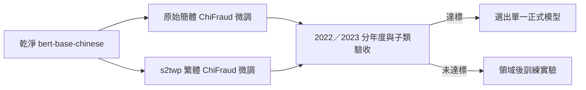

# ADR-0001：以 ChiFraud 乾淨微調建立 BERT 詐騙輔助模型

> **狀態**：已接受
> **日期**：2026-07-23
> **決策者**：專案負責人
> **摘要**：捨棄現有詐騙 checkpoint，從 `bert-base-chinese` 建立簡體與台灣繁體兩個候選模型；只有乾淨分類微調未達驗收標準時，才追加領域後訓練。

## 背景

現有 BERT checkpoint 的訓練來源、標籤方向與推論契約不夠可靠。舊訓練 notebook 定義 0 為正常、1 為詐騙，但 runtime 曾固定讀取第 0 個輸出作為詐騙分數，因此既有低風險結果不能用來判定 BERT 架構失效。

ChiFraud 是現階段可取得且具詐騙子類標註的大型中文詐騙資料，但以中國大陸網頁語境為主，不能代表台灣真實成效。專案目前只有台灣模擬診斷集，沒有台灣真實評估集。

## 決策

- 不沿用現有 `bert_fraud` checkpoint；兩個候選模型都從乾淨的 `bert-base-chinese` 預訓練權重開始。
- 模型仍是二元 BERT 詐騙輔助模型，標籤契約固定為 0＝NORMAL、1＝FRAUD；詐騙子類只用於取樣與分項驗收。
- 合併 ChiFraud 的既有年度來源，先去重，再依 `(年度, 詐騙子類)` 分層切成 80% training、10% validation、10% test。同一內容及其簡繁版本必須留在同一 split。
- 建立原始簡體候選模型與 `s2twp` 台灣繁體候選模型；兩者使用相同資料 ID、split、取樣、超參數及 seed，並交叉接受簡體與繁體 test view。
- 每個 epoch 的正常：詐騙樣本約為 2:1；詐騙子類採平方根反頻率補償並限制最大倍率，避免高頻類型主導與稀有類型過度複製。
- 分類微調最多 8 epochs，patience 為 2；只有第 8 epoch 仍改善時，追加實驗才可延長至 12 epochs。
- validation 用於信心校準、門檻選擇與 checkpoint 選擇；test 只作最終驗收。
- 若兩候選模型在兩年度的 Macro-F1 與詐騙 Recall 差距均小於 1 個百分點，視為等效並部署繁體模型。簡體模型只有在多年度結果一致顯著較好時才可獲選；其部署只轉換 BERT 輸入，不修改規則證據與使用者原文。
- 乾淨分類微調未達候選模型驗收時，不部署該候選模型，才進入 ChiFraud 遮罩語言模型領域後訓練，再重新進行分類微調。
- 正式 runtime 同時只載入一個獲選模型，不建立雙模型 ensemble。

## 結果

### 正面結果

- 移除舊 checkpoint 與錯誤標籤方向對評估的干擾。
- 用成對實驗直接回答簡繁轉換是否具有實際收益。
- 保留 ChiFraud 大型標註資料的價值，同時用分年度及分子類指標暴露分布漂移與類別失衡。
- 領域後訓練由明確失敗條件觸發，不先增加 Kaggle 成本。
- localhost 只部署一個模型，推論記憶體與維護成本不增加。

### 負面結果與限制

- 即使通過 ChiFraud 驗收，仍不能宣稱已驗證台灣真實準確率。
- 由簡體轉成繁體不會自動產生台灣真實語境，只能測量字體與部分用語正規化的影響。
- 分層重新切分後無法直接與 ChiFraud 論文的官方 held-out 設定作完全等同比較。
- 簡繁雙候選會增加一次性 Kaggle 訓練時間與模型產物空間。

## 被否決的替代方案

- **從隨機權重訓練完整中文 BERT**：ChiFraud 的資料規模與 Kaggle 計算資源不足以重新建立通用中文語言能力。
- **延續現有詐騙 checkpoint**：標籤方向與訓練 provenance 不可靠，無法建立可信 baseline。
- **第一階段直接做領域後訓練**：尚未排除舊 checkpoint 與標籤錯誤；先增加訓練階段無法證明必要性。
- **只訓練繁體或只訓練簡體模型**：無法回答字體轉換是否改善效果。
- **同時部署簡繁兩個模型並 ensemble**：增加 localhost 記憶體與推論成本，但目前沒有證據證明收益。

## 後續條件

- 候選模型必須攜帶資料來源、commit、hash、split seed、OpenCC 版本、base model revision、訓練參數、標籤映射、校準參數、門檻及完整驗收指標。
- 未取得資料作者或授權條款允許前，不把 ChiFraud 重新發布為公開 Kaggle Dataset。
- 未來取得台灣真實評估集後，另立決策評估台灣語境的監督式持續微調，不以台灣模擬診斷集取代。
